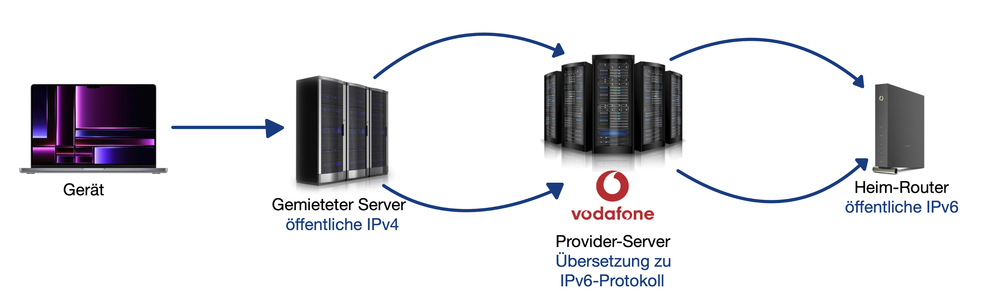

# Home-VPN-with-DS-Lite

    In diesem Projekt beschreibe ich den Aufbau und Ablauf einer VPN Verbindung in das Heimnetzwerk über einen s.g. DS-Lite-Anschluss.

    -------- Mein Ziel -------------------------
    --> einen leistungsstarken PC über ein Wake-On-Lan Signal zu starten
    --> Remote Verbindung zu dem PC
    ==> Zugang zu hoher Rechenleistung von überall auf der Welt aus

  
    -------- Mein Setup -------------------------
    --> Vodafone Standard-Router mit DS-Lite Vertrag
    --> Raspberry Pi
    --> PC
    --> Laptop
    # Alles über LAN-Kabel angeschlossen
    --> Wireguard VPN
        -> effizienter als andere Alternativen
        -> einfache und unkomplizierte Handhabung
        -> wird vom MacBook über das iPhone bis hin zum iPad nativ im Appstore angeboten
        -> hohe Sicherheit gegenüber Wireshark etc. (hoher Verschlüsselungsgrad)

    -------- DS-Lite Problematik ----------------
    --> Aufgrund der wachsenden Anzahl an Geräten sinkt die Anzahl der öffentlich verfügbaren IPv4-Adressen (max 2^32)
    --> IPv6 löst diese Problematik mit insgesamt 2^128 Adressen
    --> Internet-Anbieter vergeben daher an die Kunden nur noch IPv6 Adressen
    --> Damit wir unseren Router über das Internet ansprechen können muss das IPv6 Protokoll auch über die VPN-Dienste funktionieren
        -> Wireguard unterstützt bisher IPv6 nicht nativ
    --> IPv6 ist mit IPv4 nicht direkt kompatibel

    -- Lösung: --------

    --> im Internet gibt es weiterhin Server mit IPv4 womit die Kommunikation funktioniert
        -> Es findet eine Übersetzung der Protokolle auf einem Server des Internet-Providers statt
    --> als Übersetzung verwenden wir einen eigenen Server mit einer öffentlichen IPv4 Adresse der mit dem Heimnetzwerk kommuniziert
    --> Somit verbinde ich mich vom meinem Laptop aus mit dem Server und bin so über diesen in meinem Heimnetzwerk
        -> Verschlüsselt und abhörsicher
        -> hohe Geschwindigkeit und geringe Latenz
        -> standortunabhängig

    ---------------- Einrichtung -------------------------
    --> Schritt für Schritt:
        -> alles updaten (sudo apt update && apt upgrade -y)
        -> Wireguard installieren (sudo apt install wireguard)
        -> (Server + RaspberryPi) IP-Weiterleitung aktivieren (sudo nano /etc/sysctl.conf) (uncomment net.ipv4.ip_forward=1)
        -> Speichere die Konfiguration (sysctl -p)
        -> (Server + RaspberryPi) Erstelle die Public- und PrivateKeys (cd /etc/wireguard) (umask 077; wg genkey | tee privatekey | wg pubkey > publickey)
        -> (Server + RaspberryPi)Erstelle die wg0.conf -- Konfigurationsdatei (sudo nano /etc/wireguard/wg0.conf)
        -> Füge die Wireguard Konfiguration in die entsprechende Datei ein (siehe Ordner)
        -> (1. RaspberryPi, 2. Server) starte die Verbindung (wg-quick up wg0)
        -> Schaue dir den Status an (wg show)
        -> Wireguard-Verbindung beim Neustart automatisch herstellen (systemctl enable wg-quick@wg0)

    -------- Ablauf --------------------------------------
    --> Start-Button auf Webseite öffnen
    --> Wake-On-Lan-Signal wird gesendet
    --> PC fährt hoch
    --> Ping-Test validiert das Hochfahren
    --> anschließend VPN-Home-Verbindung trennen und per Remote-Desktop verbinden
    --> ggfs. nach dem Hochfahren die Möglichkeit gezielt mit Windows einen Reboot zu veranlassen

    -------- Remote Desktop Apps -------------------------
    --> LINUX: RustDesk
        -> verwendet effiziente Datenübertragung
        -> Verbindung verschlüsselt
        -> keine Latenz spürbar

    --> WINDOWS: Parsec
        -> für Windows optimiert
        -> optimale Grafikübertragung
        -> keine Latenz spürbar (geeignet für Programme mit einer Notwendigkeit von geringer Reaktionszeiten)
        -> geeignet für grafikintensive Spiele

    -------- Weiteres zu Beachten ------------------------
    --> alle IP- und MAC-Adressen müssen entsprechend angepasst werden (eigene IP: ifconfig, alle IP-Adressen im Netzwerk: arp -a) 
    --> zum Bearbeiten der wg0.conf -> davor: wg-quick down wg0, danach: wg-quick up wg0 zur Wirksamkeit der Änderungen
    --> Test der Verbindung mit ping 192.168.XX.XX
    --> in meinem Fall: Gigabyte Mainboard und Netzwerkkarte: WakeOnLan-Funktion ist vorhanden aber nicht im BIOS integriert
        -> standardmäßig ist WakeOnLan deaktiviert
        --> ich habe ein Bash-Skript geschrieben welches als Systemprozess beim Hochfahren ausgeführt wird und somit beim nächsten 
            Hochfahren im ROM-Speicher die Aktivierung des WakeOnLan-Signal speichert (in diesem Repo nicht hinterlegt)
    --> für die Webseite:
        -> Apache2 Webserver installieren
        -> Webseite in den Ordner: /etc/www/html/    verschieben (Tipps sind im Support-Fraud.-Repo)
    --> Hilfreiches Video bei Problemen: https://youtu.be/kIK0I9dwXh8 (Kanal: Apfelcast, Video-Titel: DS-Lite Portfreigaben erstellen inkl. ReverseProxy und VPN-Server)
    ===> Server muss darüberhinaus vor unbefugten Zugriff geschützt werden (siehe Hacker-Oli-Repo)
    

Viel Spaß beim Umsetzen!
